# Dev 3 — Sơ đồ luồng hoạt động (Mermaid)

> Tài liệu mô tả luồng hoạt động của phần Dev 3 — Nhân sự Core (Employee Core) bằng sơ đồ Mermaid.

---

## 1. Tổng quan Use Case

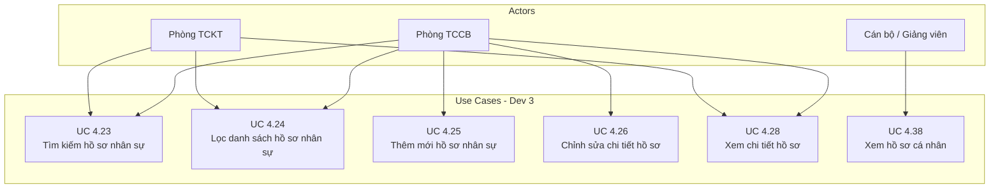

---

## 2. Kiến trúc tổng thể Dev 3

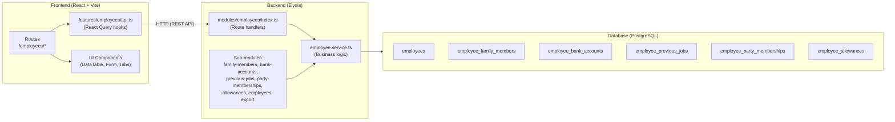

---

## 3. UC 4.23 — Tìm kiếm hồ sơ nhân sự

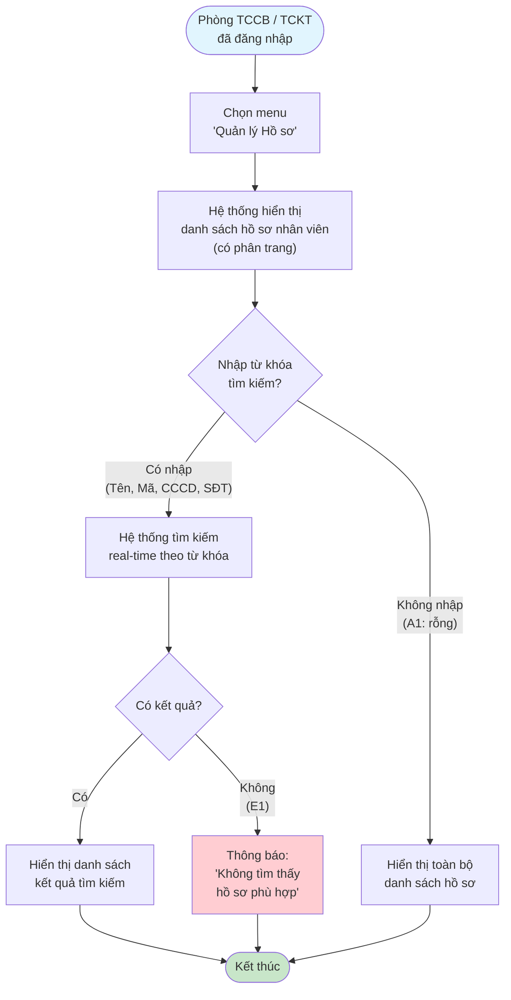

### Luồng kỹ thuật tìm kiếm

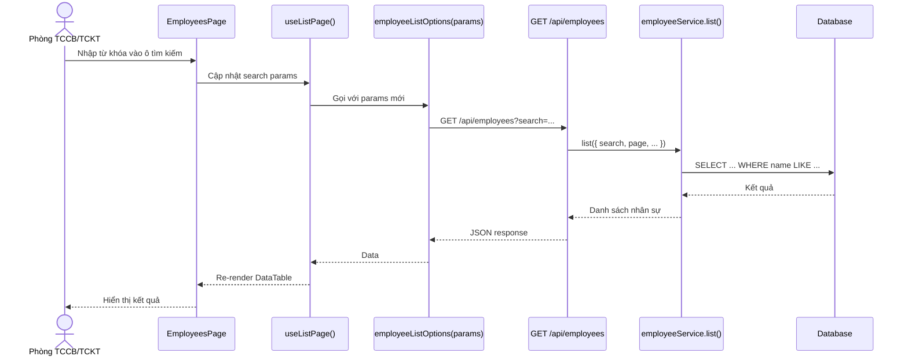

---

## 4. UC 4.24 — Lọc danh sách hồ sơ nhân sự

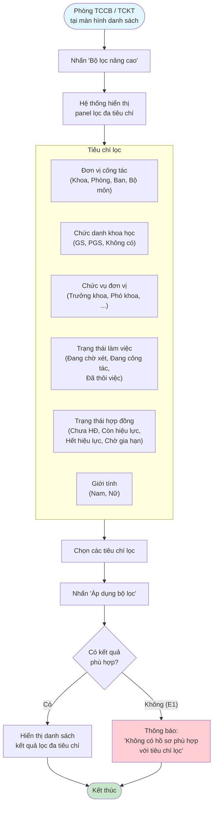

---

## 5. UC 4.25 — Thêm mới hồ sơ nhân sự

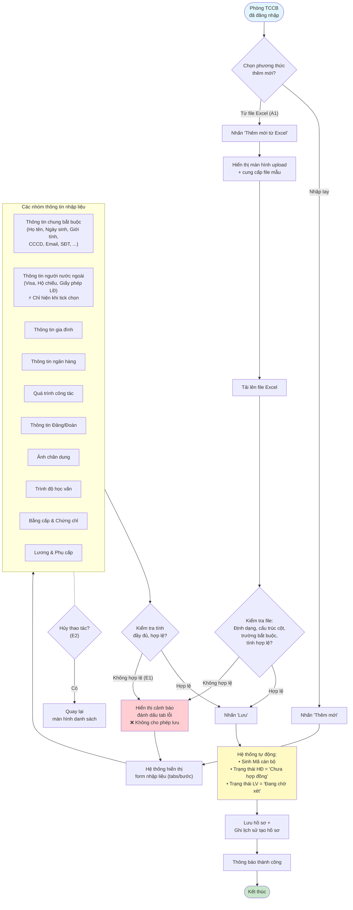

### Luồng kỹ thuật thêm mới

```mermaid
sequenceDiagram
    actor User as Phòng TCCB
    participant Page as NewEmployeePage
    participant Upload as uploadFile()
    participant Create as useCreateEmployee()
    participant BE as POST /api/employees
    participant SVC as employee.service.create()
    participant SubAPI as Sub-entity APIs
    participant DB as Database

    User->>Page: Mở form tạo mới
    Page-->>User: Render form lớn (tabs/bước)
    
    User->>Page: Upload ảnh / file PDF
    Page->>Upload: uploadFile(file)
    Upload->>BE: POST /api/files/upload
    BE-->>Upload: URL file
    
    User->>Page: Nhấn "Lưu hồ sơ nhân sự"
    Page->>Create: onSubmit(data)
    Create->>BE: POST /api/employees
    BE->>SVC: create(data)
    SVC->>DB: INSERT INTO employees
    DB-->>SVC: employeeId
    SVC-->>BE: Employee created
    BE-->>Create: { id: employeeId }

    Note over Page,SubAPI: Sau khi có employeeId → tạo sub-entities

    par Tạo song song các thực thể phụ
        Create->>SubAPI: POST /employees/:id/family-members
        Create->>SubAPI: POST /employees/:id/bank-accounts
        Create->>SubAPI: POST /employees/:id/previous-jobs
        Create->>SubAPI: POST /employees/:id/party-memberships
        Create->>SubAPI: POST /employees/:id/allowances
    end

    SubAPI->>DB: INSERT sub-entities
    DB-->>SubAPI: OK

    SubAPI-->>Page: All done
    Page->>Page: invalidate employeeKeys.lists()
    Page-->>User: toast.success() → điều hướng về /employees
```

---

## 6. UC 4.26 — Chỉnh sửa chi tiết hồ sơ nhân sự

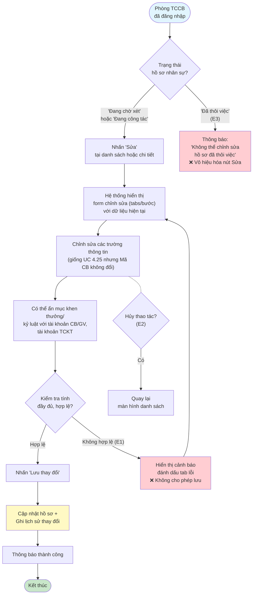

### Luồng kỹ thuật chỉnh sửa (syncSubEntities)

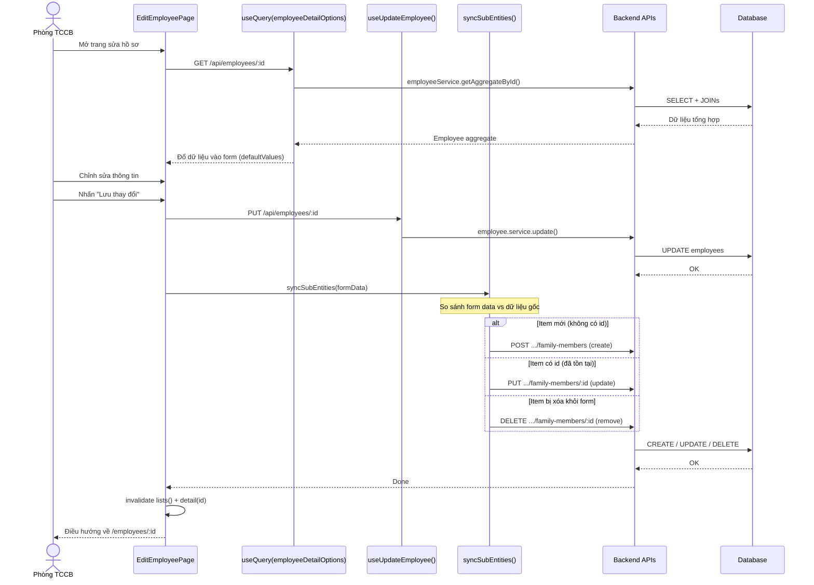

---

## 7. UC 4.28 — Xem chi tiết thông tin hồ sơ nhân sự

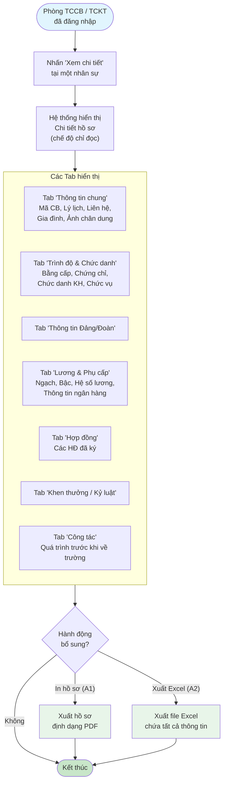

### Luồng kỹ thuật xem chi tiết

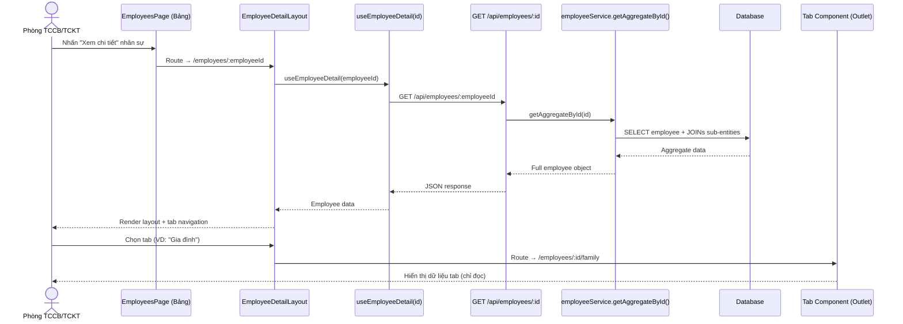

---

## 8. UC 4.38 — Xem hồ sơ cá nhân (Cán bộ/Giảng viên)

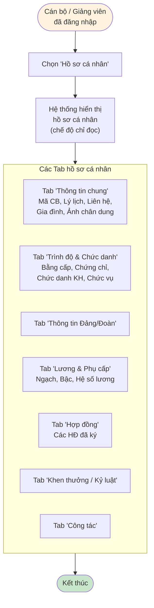

### Luồng kỹ thuật hồ sơ cá nhân

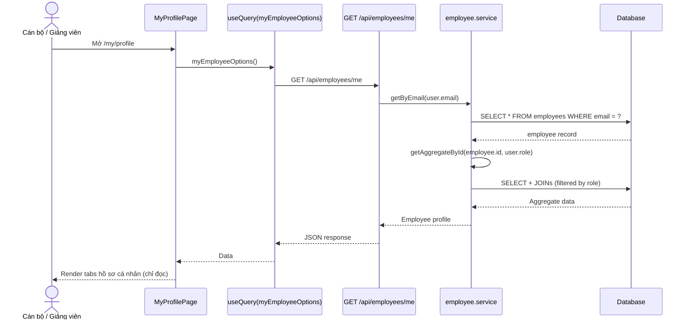

---

## 9. Luồng tổng hợp toàn bộ Dev 3

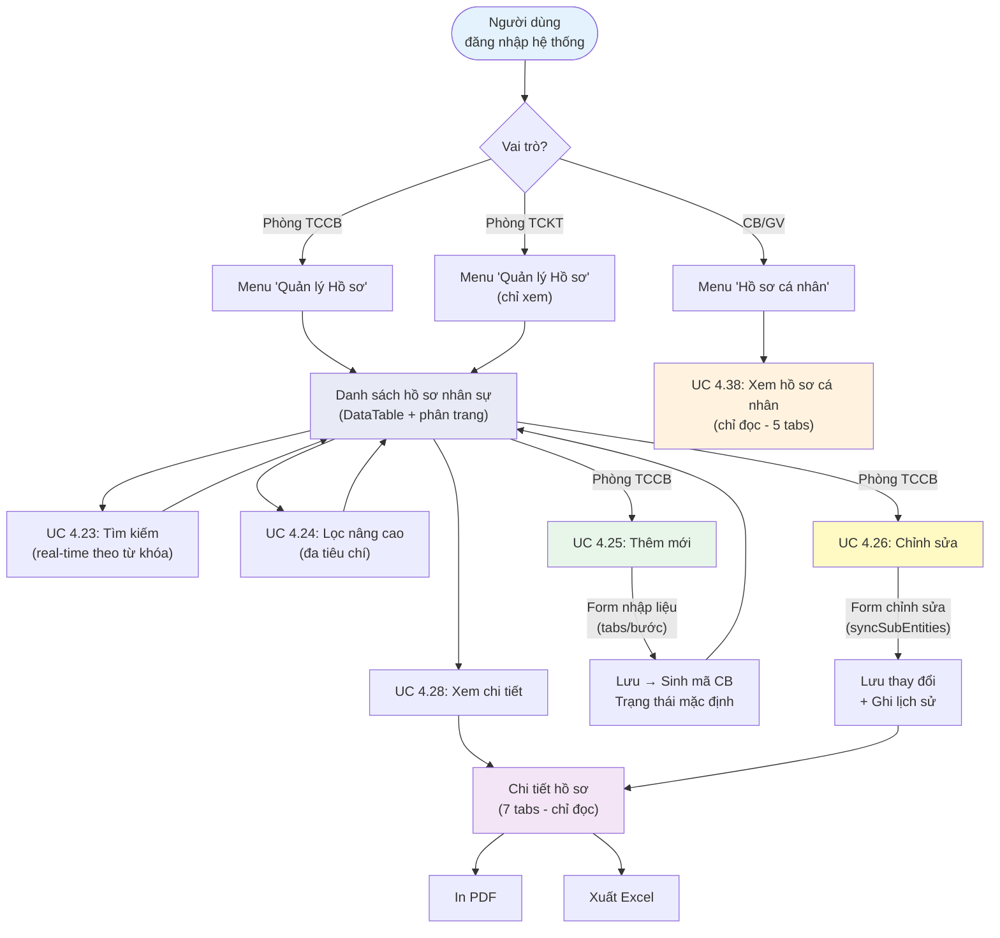

---

## 10. Sơ đồ API Endpoints

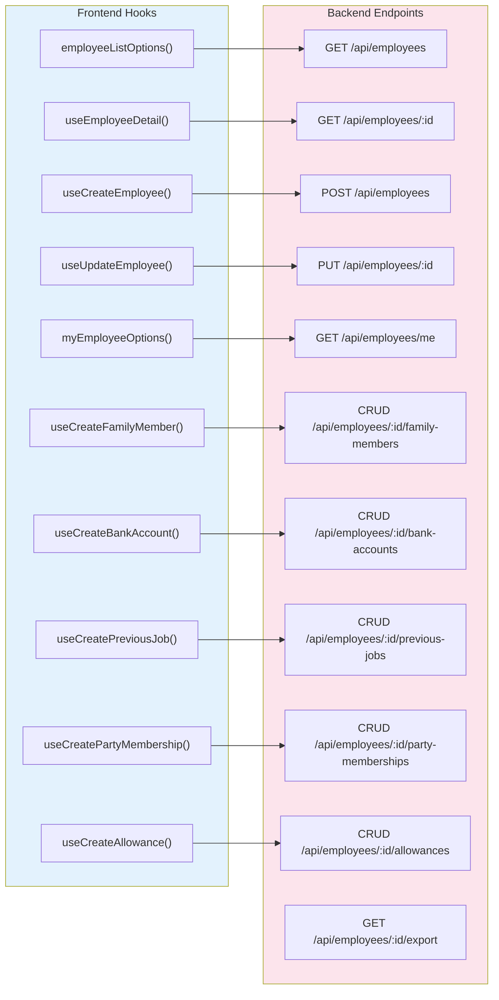

---

## 11. State Diagram — Trạng thái nhân sự

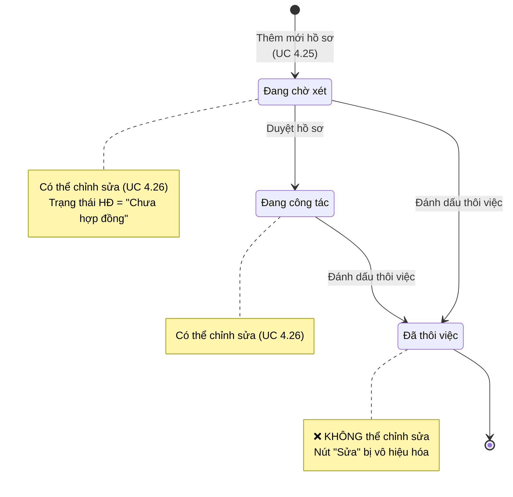

---

## 12. Phân quyền theo vai trò

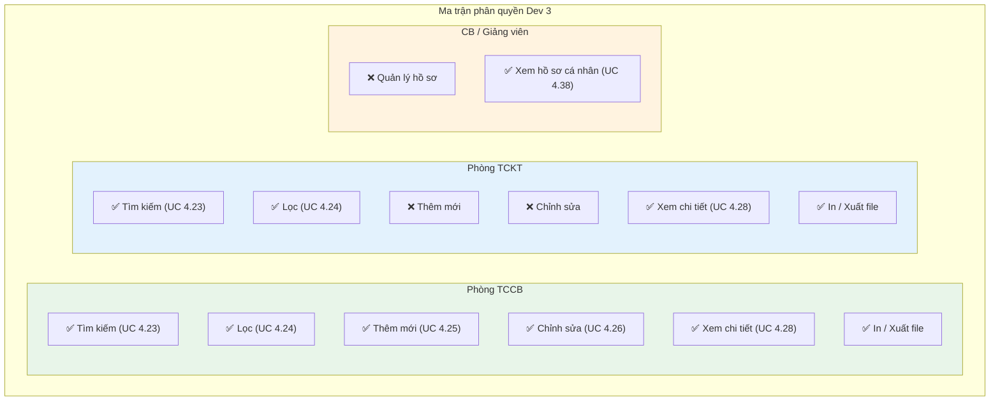
